<!-- Animated contribution graph: real data scraped from GitHub's public
     contributions endpoint, regenerated daily by
     .github/workflows/update-profile-art.yml -->

<h3><code>ce017@github ~ $ ./contributions.sh</code></h3>

 
 

<!-- Braille-art panel beside a neofetch-style info card.
     regenerate art:  python scripts/make_braille_svg.py   (source: ascii-art.txt)
     regenerate card: python scripts/make_info_card.py
     Widths below are matched so both columns render the same height:
     322 x 1.625 = 523   and   538 x 0.975 = 524 -->

<h3><code>ce017@github ~ $ whoami</code></h3>

<table>
<tr>
<td valign="top"></td>
<td valign="top"></td>
</tr>
</table>

 
 

<h3><code>ce017@github ~ $ ./links.sh</code></h3>

<b>Roblox Developer · Websites &amp; Web Apps</b>

<!-- Discord has no profile URL derivable from a handle (it needs the numeric
     user ID), so this one is a plain badge rather than a link. -->

 

